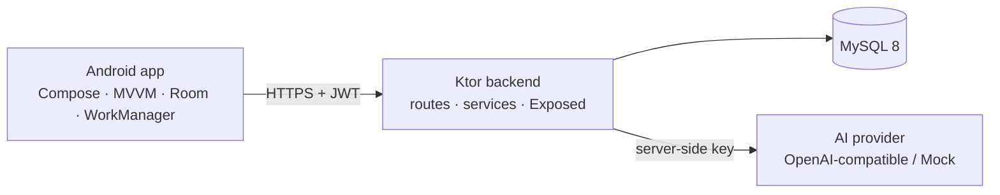

# LinguaAI — AI-Powered Language Learning Platform

> **Learn smarter with your personal AI language tutor.**

A full-stack language-learning platform: a native **Android app** (Kotlin, Jetpack Compose)
with offline-first learning data, a **Ktor backend** on MySQL with JWT authentication, and a
**server-side AI gateway** that powers a context-aware tutor — without ever shipping an AI API
key inside the app.

| Layer | Stack |
| --- | --- |
| Mobile | Kotlin, Jetpack Compose, Material 3, MVVM + Clean Architecture, Hilt, Room, DataStore, WorkManager |
| Backend | Kotlin, Ktor 3, Exposed, Flyway, JWT (access + refresh rotation), bcrypt |
| Database | MySQL 8 in Docker; H2 in-memory (MySQL mode) for integration tests |
| AI | Provider-agnostic gateway (OpenAI-compatible / Mock), server-built prompts, bounded conversation memory, per-user rate limiting |
| Quality | 69 tests — JUnit 5 + ktor-server-test-host + H2 on the server, JUnit 4 + MockWebServer + Room `MigrationTestHelper` on Android, GitHub Actions CI |
| Delivery | Docker Compose, multi-stage backend image, Conventional Commits, Mermaid documentation |

## Features

**Learning**
- Onboarding by language, level and daily goal
- Lesson catalogue, vocabulary with search and favourites, grammar reference
- Flashcards with a pluggable spaced-repetition scheduler (`ReviewScheduler`, SM-2 derivative)
- Quiz engine with attempt tracking and grading

**AI Tutor**
- Chat, grammar explanation, sentence correction, conversation practice with scoring
- Context-aware: knows the current lesson, the grammar in focus and the learner's recurring weak topics
- Bounded memory — recent turns plus a capped rolling summary, so cost stays flat as a conversation grows
- Runs on a deterministic mock provider for offline development and demos

**Platform**
- Offline-first: Room is the source of truth for the UI, the network refreshes it
- Idempotent background sync through an outbox — a retry can never double-count
- Progress and streaks derived server-side; the device never computes them
- Study reminders via WorkManager
- Sign-out clears the session, cancels scheduled work and wipes cached user data

## Architecture in one picture



The client never calls an AI provider directly and never sends system instructions — the backend
builds the prompt from trusted data. Full detail, including six ADRs with the alternatives that
were rejected, in [docs/architecture](docs/architecture/README.md).

## Quick start

```bash
# Backend + MySQL
cp .env.example .env       # fill in JWT_SECRET, DB_PASSWORD, DB_ROOT_PASSWORD
docker-compose up --build  # or: docker compose up --build
curl http://localhost:8080/api/v1/health
```

```bash
# Android
cd android
JAVA_HOME=/path/to/jdk-24 ./gradlew assembleDebug
# or open android/ in Android Studio
```

The debug build targets `http://10.0.2.2:8080/api/v1/` — the host loopback as seen from an
emulator.

> **`JAVA_HOME` is not optional.** Gradle takes its JDK from `JAVA_HOME`, not from `java` on
> `PATH`. With a newer JDK on `PATH` and `JAVA_HOME` unset, the build fails with a bare version
> number as the entire error message.

## Tests

```bash
cd server  && JAVA_HOME=/path/to/jdk-24 ./gradlew test                  # 35 tests
cd android && JAVA_HOME=/path/to/jdk-24 ./gradlew testDebugUnitTest     # 34 tests
```

Both suites run offline — no network, no database, no AI key. The AI paths are exercised through
the mock provider, including the failure modes (timeout, empty response, unparseable output, rate
limiting).

Four Room migration tests exist but need a device or emulator
(`connectedDebugAndroidTest`). **They have not been run yet** — see
[docs/TESTING.md](docs/TESTING.md#tests-that-are-missing-and-why), which lists what is missing
rather than quietly omitting it.

## Project layout

```
android/          Kotlin + Compose app (single module, layered packages)
  app/src/main/java/com/linguaai/app/
    data/         remote (Retrofit) · local (Room) · datastore · session · work
    domain/       models · repository interfaces · use cases · validation · SRS
    di/           Hilt modules
    ui/           screens · components · theme · navigation
  app/schemas/    exported Room schemas (migration baseline)
server/           Ktor backend
  src/main/kotlin/com/linguaai/server/
    api/ ai/ config/ db/ plugins/ repository/ routes/ security/
  src/main/resources/db/migration/   Flyway V1 schema, V2 seed
docs/             architecture + ADRs · API · ERD · diagrams · guides
plans/            local planning artefacts (gitignored)
```

## Documentation

| Document | Contents |
| --- | --- |
| [Architecture](docs/architecture/README.md) | Layers, AI gateway, offline-first, token refresh, plus six ADRs |
| [API reference](docs/api/README.md) | Every endpoint, error codes, token shapes, failure mapping |
| [Database](docs/database/erd.md) | ER diagram of all 17 tables and the constraints that carry design weight |
| [Diagrams](docs/diagrams/README.md) | System, layering, auth, AI path, offline sync, progress aggregation |
| [Development](docs/DEVELOPMENT.md) | Setup, run, conventions, troubleshooting |
| [Testing](docs/TESTING.md) | What each suite covers and what is deliberately missing |
| [Deployment](docs/DEPLOYMENT.md) | Docker, configuration, and the known limitations |
| [Working agreement](docs/WORKFLOW.md) | Plan identity, execution cadence, verification budget, reporting contract |

## Known limitations

Stated rather than glossed over:

- **Rate limiting is in-process.** More than one backend instance multiplies the effective quota.
  Needs a shared counter before horizontal scaling.
- **Conversation memory is bounded, and the summary is extractive.** It preserves topic
  continuity, not nuance.
- **Room migrations have never executed.** They are validated against the exported schema only.
- **No static analysis.** detekt and ktlint are not configured; the codebase is not currently
  lint-gated.
- **No TLS termination** in the Compose stack, and no database backup.

## Contributing

Conventional Commits (`feat:`, `fix:`, `chore:`, `test:`, `docs:`). Run the build before
committing — a period of this project's history has five consecutive commits on a tree that did
not compile, because nothing ran the build.

## License

[MIT](LICENSE)
