# LinguaAI — AI-Powered Language Learning Platform

[](https://github.com/JasonTM17/Language_Kotlin_App/actions/workflows/android-ci.yml)

> **Learn smarter with your personal AI language tutor.**

A full-stack language-learning platform: a native **Android app** (Kotlin, Jetpack Compose)
with offline-first learning data, a **Ktor backend** on MySQL with JWT authentication, and a
**server-side AI gateway** that powers a context-aware tutor — without ever shipping an AI API
key inside the app.

| Layer | Stack |
| --- | --- |
| Mobile | Kotlin, Jetpack Compose, Material 3, MVVM + Clean Architecture, Hilt, Room, DataStore, WorkManager |
| Backend | Kotlin, Ktor 3, Exposed, Flyway, JWT (access + refresh rotation), bcrypt |
| Database | MySQL 8 in Docker; H2 in-memory (MySQL mode) for integration tests |
| AI | Provider-agnostic gateway (OpenAI-compatible / Mock), server-built prompts, retrieval-grounded answers over a Qdrant/SQL vector store, bounded conversation memory, per-user rate limiting |
| Quality | Server and Android unit/instrumented suites, detekt and ktlint as blocking CI gates; exact current counts are recorded in the [testing guide](docs/TESTING.md) |
| Delivery | Docker Compose, backend images in GHCR and Docker Hub, Conventional Commits, Mermaid documentation |

## Features

**Learning**
- Onboarding by language, level and daily goal
- Multilingual catalogue with 17 learning languages, 2,000,000 imported
  dictionary entries and 900 curated seed records, plus bounded search, level
  filters and favourites — see the [catalogue import guide](docs/data/multilingual-vocabulary.md)
- Lesson catalogue, grammar reference and review flows
- Progress screen with a 14-day activity heatmap and six achievement badges
  derived on the fly from the cached study summary — never persisted
- Flashcards with a pluggable spaced-repetition scheduler (`ReviewScheduler`, SM-2 derivative),
  graded by horizontal swipe (right for GOOD, left for AGAIN) with a flip-in answer reveal
- On-demand recorded word pronunciations from Wiktionary/Commons when an exact-language,
  reusable recording is available, with visible file/author/license credits and a locale-correct
  Android TTS fallback; coverage is partial — see the [pronunciation guide](docs/PRONUNCIATION.md)
- **Listen & Type** practice from Learn: hear up to ten due vocabulary words, type each answer,
  and review the word, meaning, and round score using the existing audio and TTS path.
- Quiz engine with attempt tracking and grading

**AI Tutor**
- Chat, grammar explanation, sentence correction, conversation practice with scoring
- Mode-aware starter chips: each tutor mode opens with suggested prompts for that mode
- **Retrieval-grounded answers**: chat and grammar turns retrieve the most relevant
  course-corpus chunks (vocabulary, grammar, lessons), cite them in the reply
  (`sources[]`), and the Android client renders the citations as chips that open
  the cited lesson or grammar page — see
  [ADR-0007](docs/architecture/adr/0007-retrieval-grounded-tutor.md)
- Tutors reply with the emphasis and bullets the server prompt asks the model for,
  rendered natively rather than as raw markup
- Interruptible replies, a scroll-to-latest control, and a real rate-limit
  countdown driven by the server's `Retry-After` grant
- Pluggable vector engine: **Qdrant** in Docker Compose, or a dependency-free SQL
  cosine store offline; the verified local catalogue index contains 2,000,935
  chunks. The repeatable load harness separately exercises 100k+ retrieval rows
  (`scripts/e2e-bigdata.sh`)
- Context-aware: knows the current lesson, the grammar in focus and the learner's
  recurring weak topics
- Bounded memory — recent turns plus a capped rolling summary, so cost stays flat as a conversation grows
- Runs on a deterministic mock provider for offline development and demos

**Platform**
- Offline-first: Room is the source of truth for the UI, the network refreshes it
- Idempotent background sync through an outbox — a retry can never double-count
- Progress and streaks derived server-side; the device never computes them
- Study reminders via WorkManager
- Sign-out clears the session, cancels scheduled work and wipes cached user data

## Screenshots

Real emulator captures from the `vi-VN` locale. The animation shows Home, AI tutor,
Japanese roleplay, Learn, and Vocabulary flows.

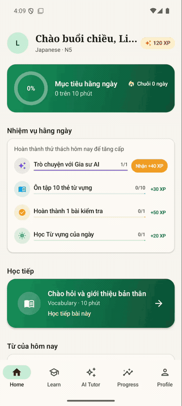

| Home | Word of the day | AI tutor |
| --- | --- | --- |
| 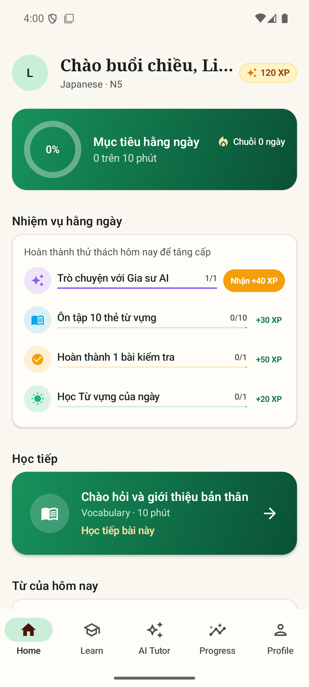 | 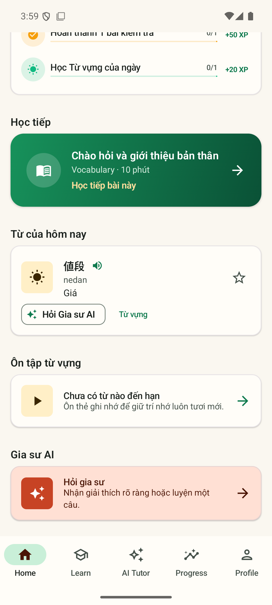 | 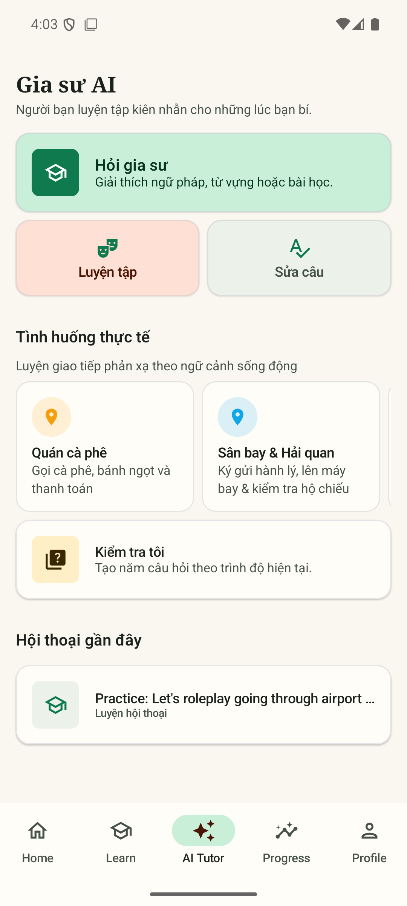 |
| Japanese roleplay | Learn | Vocabulary |
| 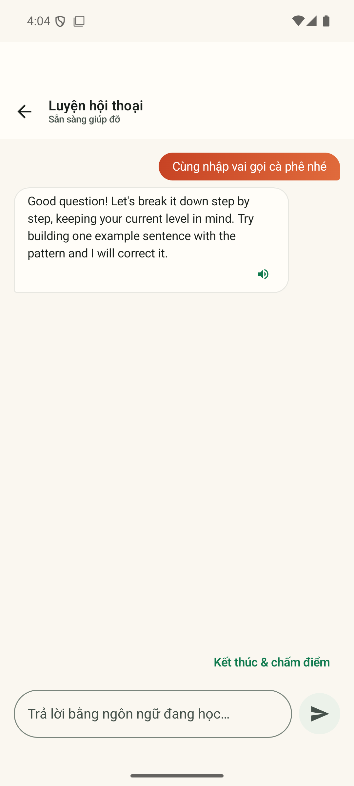 | 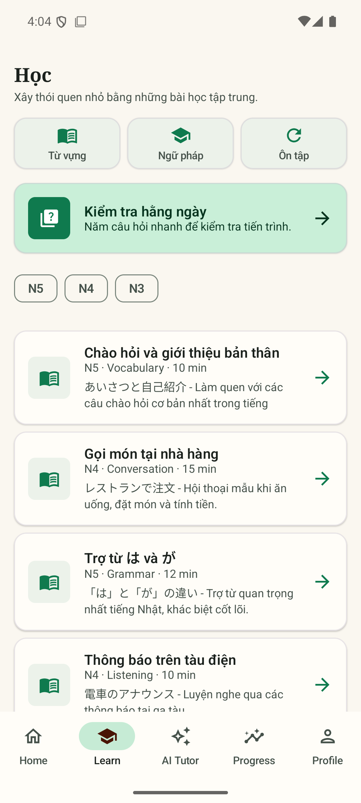 | 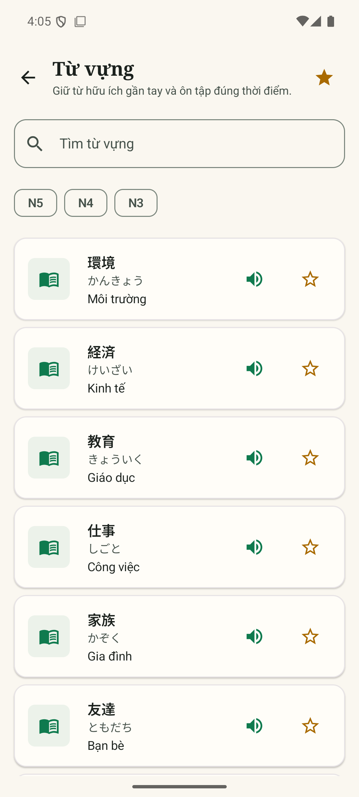 |
| Flashcard review |
| --- |
| 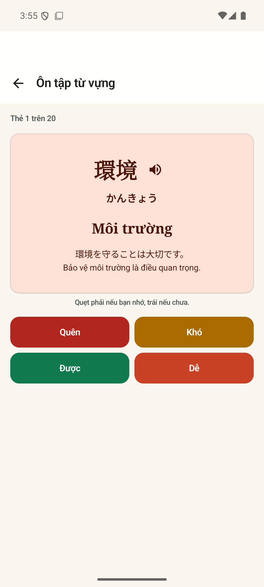 |

Listen & Type question, answer feedback, and completion screens:

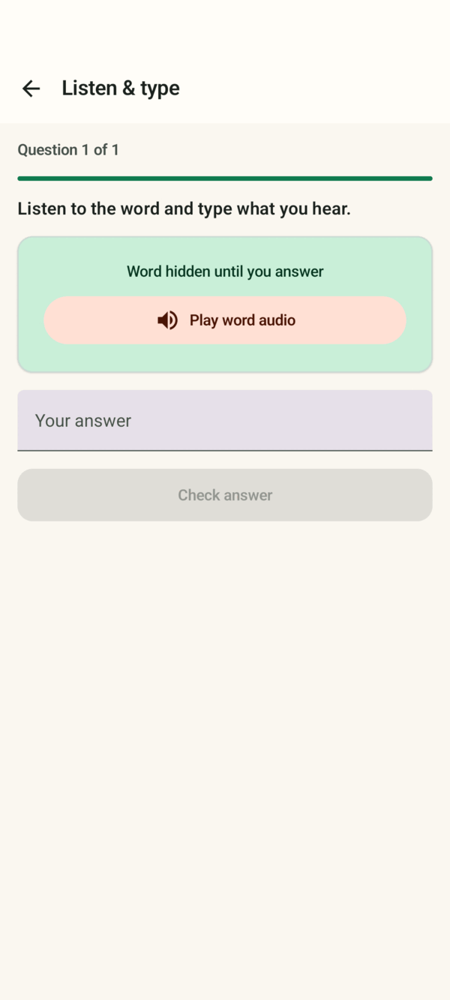

These three screens come from the Android 15 Compose UI test fixture (`hello` / `greeting`);
the capture verifies the rendered flow and does not record audible playback. See the
[screenshot capture notes](docs/screenshots/README.md#listen-and-type) and
[Android test evidence](docs/TESTING.md#android-instrumented-tests).

| Question | Answer feedback | Round complete |
| --- | --- | --- |
| 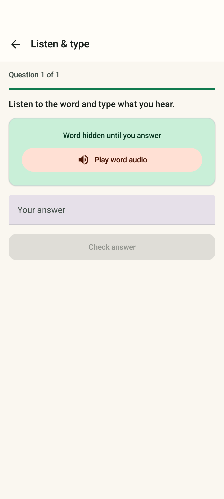 | 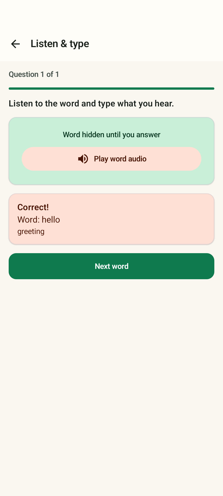 | 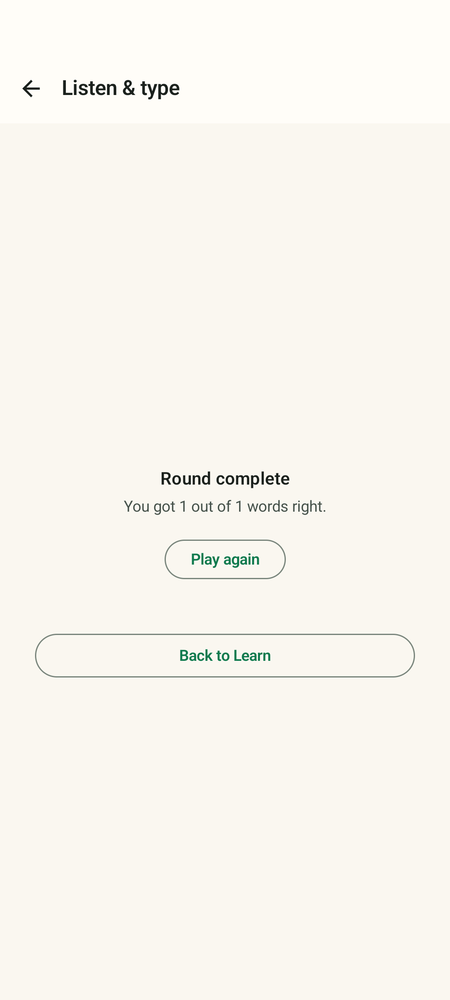 |

## Architecture in one picture

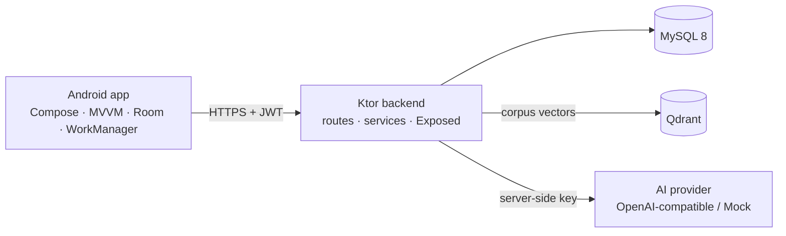

The client never calls an AI provider directly and never sends system instructions — the backend
builds the prompt from trusted data. Retrieval grounds tutor answers in the course corpus; the
vector engine falls back to SQL cosine search when Qdrant is not configured
([ADR-0007](docs/architecture/adr/0007-retrieval-grounded-tutor.md)). Full detail, including
seven ADRs with the alternatives that were rejected, in
[docs/architecture](docs/architecture/README.md).

## Quick start

```bash
# Backend + MySQL
cp .env.example .env       # fill in JWT_SECRET, DB_PASSWORD, DB_ROOT_PASSWORD
docker-compose up --build  # or: docker compose up --build
curl http://localhost:8080/api/v1/health
```

```bash
# Android
cd android
JAVA_HOME=/path/to/jdk-24 ./gradlew assembleDebug
# or open android/ in Android Studio
```

The debug build targets `http://10.0.2.2:8080/api/v1/` — the host loopback as seen from an
emulator.

If another local project already owns port 8080, run the backend on a different host port and
point only the debug APK at it, for example:

```bash
SERVER_PORT=8081 docker-compose --env-file .env up --build -d backend
cd android && JAVA_HOME=/path/to/jdk-24 ./gradlew assembleDebug \
  -Plinguaai.debugBaseUrl=http://10.0.2.2:8081/api/v1/
```

The override is debug-only; release builds keep their configured production endpoint.
To pull and run the published backend image instead of building locally, see the
[deployment guide](docs/DEPLOYMENT.md#published-backend-images).

> **`JAVA_HOME` is not optional.** Gradle takes its JDK from `JAVA_HOME`, not from `java` on
> `PATH`. With a newer JDK on `PATH` and `JAVA_HOME` unset, the build fails with a bare version
> number as the entire error message.

## Tests

```bash
cd server  && JAVA_HOME=/path/to/jdk-24 ./gradlew test
cd android && JAVA_HOME=/path/to/jdk-24 ./gradlew testDebugUnitTest
```

Both suites run offline — no network, no database, no AI key. The AI paths are exercised through
the mock provider, including the failure modes (timeout, empty response, unparseable output, rate
limiting). The RAG pipeline is covered by unit tests (embedder contract, chunker) and
full-module integration tests (retrieval relevance, structural language isolation, prompt
injection fence, idempotent reindex, ops-token auth, seed/purge round trip).

The reproducible big-scale driver is `bash scripts/e2e-bigdata.sh`. The recorded live
evidence — real MySQL 8, real Qdrant, 100k+ corpus rows and embedded chunks, retrieval
latency percentiles and post-seed relevance — is kept in the repository's plan reports
rather than asserted by CI; environments without Docker-enabled Bash can follow the
same manual-equivalent checkpoints.

Android unit and instrumented test evidence, including dated device results, is
recorded in the [testing guide](docs/TESTING.md#android-instrumented-tests). A live
authenticated UI-to-backend/provider walk remains a separate runtime gate.

## Project layout

```
android/          Kotlin + Compose app (single module, layered packages)
  app/src/main/java/com/linguaai/app/
    data/         remote (Retrofit) · local (Room) · datastore · session · work
    domain/       models · repository interfaces · use cases · validation · SRS
    di/           Hilt modules
    ui/           screens · components · theme · navigation
  app/schemas/    exported Room schemas (migration baseline)
server/           Ktor backend
  src/main/kotlin/com/linguaai/server/
    api/ ai/ config/ db/ ops/ plugins/ repository/ routes/ security/
  src/main/resources/db/migration/   Flyway V1 schema, V2/V3 catalogue seeds, V5 knowledge chunks, V7 language/index metadata
scripts/          Live E2E harness and reproducible catalogue importer
docs/             architecture + ADRs · API · ERD · diagrams · guides
plans/            local planning artefacts (gitignored)
```

## Documentation

| Document | Contents |
| --- | --- |
| [Architecture](docs/architecture/README.md) | Layers, AI gateway, offline-first, token refresh, plus seven ADRs |
| [API reference](docs/api/README.md) | Every endpoint, error codes, token shapes, failure mapping |
| [Database](docs/database/erd.md) | ER diagram of all 17 tables and the constraints that carry design weight |
| [Catalogue data](docs/data/multilingual-vocabulary.md) | Source attribution, quotas, checksum-verified import and reindex procedure |
| [Diagrams](docs/diagrams/README.md) | System, layering, auth, AI path, offline sync, progress aggregation |
| [Development](docs/DEVELOPMENT.md) | Setup, run, conventions, troubleshooting |
| [Testing](docs/TESTING.md) | What each suite covers and what is deliberately missing |
| [Pronunciation](docs/PRONUNCIATION.md) | Audio sources, licensing, language matching and privacy |
| [Deployment](docs/DEPLOYMENT.md) | Docker, configuration, and the known limitations |
| [Working agreement](docs/WORKFLOW.md) | Plan identity, execution cadence, verification budget, reporting contract |

## Known limitations

Stated rather than glossed over:

- **Rate limiting is in-process.** More than one backend instance multiplies the effective quota.
  Needs a shared counter before horizontal scaling.
- **Conversation memory is bounded, and the summary is extractive.** It preserves topic
  continuity, not nuance.
- **The default retrieval embedder is lexical, not semantic.** Offline (mock provider) grounding
  uses deterministic feature hashing — exact-token matching with no synonym or cross-lingual
  generalization. Configure an OpenAI-compatible provider and reindex for semantic embeddings
  ([ADR-0007](docs/architecture/adr/0007-retrieval-grounded-tutor.md)).
- **Scale is single-node evidence, not a distributed-capacity claim.** The live Compose stack
  indexes the verified two-million-row catalogue in Qdrant, and the repeatable harness exercises
  100k+ retrieval rows; neither proves multi-node capacity or a production SLO.
- **The two-million-row catalogue is source data, not a ranked curriculum.** The import preserves
  third-party dictionary glosses and POS categories; frequency/rank-based pedagogy remains a
  separate product phase. See the [catalogue guide](docs/data/multilingual-vocabulary.md) for
  licenses, checksums and the bounded reindex workflow.
- **Recorded pronunciations are best-effort and not available for every word or dialect.** The app
  checks only on a speaker tap and falls back to Android TTS with the selected language locale. A
  lookup sends the selected headword and language code to Wikimedia; the request also exposes
  ordinary network metadata such as the device's IP address. See the [pronunciation guide](docs/PRONUNCIATION.md).
- **The current Room migration chain through version 7 has executed on the
  `linguaai-api35` emulator.** The latest Android test date and counts are in the
  [testing guide](docs/TESTING.md#android-instrumented-tests). A separate
  authenticated route walk exercised Home, Learn, Vocabulary, Grammar, Review
  and Daily Quiz against the local backend; hosted CI and production verification
  remain separate gates.
- **No TLS termination** in the Compose stack, and no database backup.

## Contributing

Conventional Commits (`feat:`, `fix:`, `chore:`, `test:`, `docs:`). Run the build before
committing — a period of this project's history has five consecutive commits on a tree that did
not compile, because nothing ran the build.

## License

[MIT](LICENSE)
