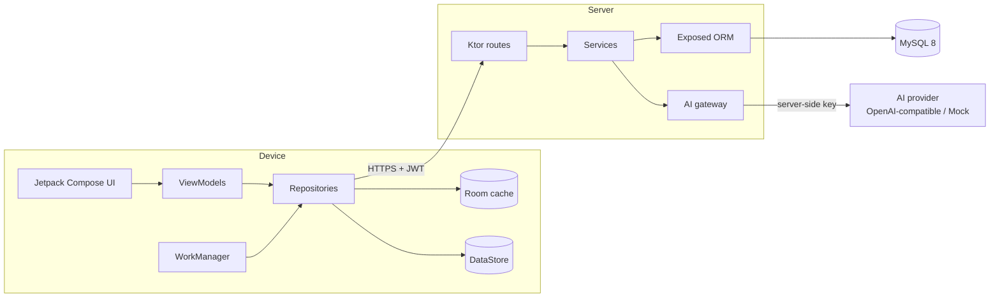
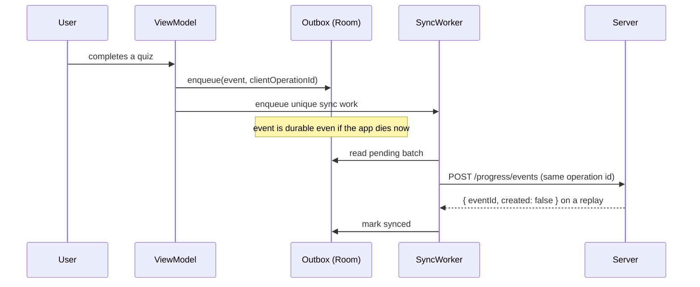
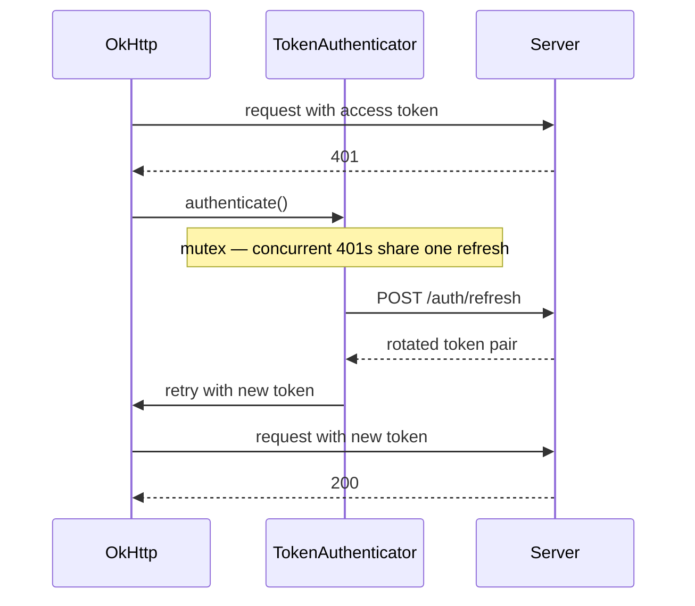

# Architecture

LinguaAI is three cooperating parts: a native Android client, a Ktor backend, and
a server-side AI gateway. The client never talks to an AI provider directly.



## Layers

### Android — single module, strict package layering

```
com.linguaai.app
├── data/          remote (Retrofit + DTOs), local (Room), repository impls,
│                  datastore (DataStore), session, work (WorkManager)
├── domain/        models, repository interfaces, validation, use cases, SRS
├── di/            Hilt modules
└── ui/            screens, components, theme, navigation
```

`domain` depends on nothing outward: it declares the repository interfaces that
`data` implements and `di` binds. A screen never touches Retrofit or Room
directly, and no composable contains business logic.

### Server — routes → services → repositories

```
com.linguaai.server
├── api/           error envelope, DTOs
├── ai/            gateway, prompt builder, providers, rate limiter
├── config/        environment configuration
├── db/            Exposed table definitions
├── plugins/       Ktor plugin installation
├── repository/    data access
├── routes/        HTTP surface
└── security/      JWT, password hashing
```

Routes resolve the authenticated principal and delegate. Services own the
business rules. Repositories own SQL. Nothing above `repository` builds a query.

## The AI gateway

The AI Tutor is the part most worth understanding.

### Why the key never reaches the device

The Android app calls `/api/v1/ai/*` on our backend. The backend holds
`AI_API_KEY` in its environment and calls the provider. An API key shipped inside
an APK is extractable from the artifact, so it is never shipped — see
[ADR-0001](adr/0001-ai-key-never-on-device.md).

### Prompts are built server-side

The client sends only user text, a mode, and context references (a lesson id, a
grammar id). The backend assembles the system prompt from trusted data: the
learner profile, the resolved target language, lesson and grammar context,
recurring weak topics, and the condensed conversation history. Because the client
cannot supply system instructions, prompt injection through the app is not
possible — see [ADR-0002](adr/0002-server-side-system-prompts.md).

The prompt is a teaching contract rather than a persona line: it states the
language being taught, level-appropriate complexity for N5–N1 and A1–C2, a
teaching method, a per-mode output contract, and boundaries that forbid inventing
grammar.

### Bounded conversation memory

Replaying a whole conversation is not viable — cost grows linearly and eventually
exceeds the context window. Memory is therefore three bounded parts:

1. **Recent messages**, sent verbatim (the tail after a watermark).
2. **A rolling summary** of everything older, itself capped in size so it cannot
   grow without bound.
3. **Learner state** — profile, weak topics — which does not grow with the
   conversation at all.

See [ADR-0004](adr/0004-bounded-conversation-memory.md).

### Provider abstraction

`AiProvider` has two implementations: `OpenAiCompatibleProvider` (any
OpenAI-compatible endpoint — OpenAI, DeepSeek, Groq) and `MockAiProvider`
(deterministic, no network). Tests and the offline demo run on the mock, so the
suite never depends on a paid provider or the network. See
[ADR-0005](adr/0005-ai-provider-abstraction.md).

### Retrieval-grounded answers (RAG)

Chat and grammar turns are grounded in the platform's own corpus. Course
documents are chunked, embedded, and stored in `knowledge_chunks`; each tutor
turn retrieves the top-k chunks scoped to the learner's language and level,
injects them into the system prompt inside a fenced `---BEGIN/END KNOWLEDGE---`
block (retrieved text is reference data, never instructions), and returns the
cited chunks as `sources[]`. The vector engine is pluggable: **Qdrant** when
`QDRANT_URL` is configured, otherwise brute-force cosine over the canonical SQL
store. The offline default embedder is deterministic and lexical — exact-token
matching without semantic generalization — and every chunk records its
embedding model so spaces can never mix. Retrieval failures degrade to an
ungrounded answer, never a 500. See
[ADR-0007](adr/0007-retrieval-grounded-tutor.md).

### Rate limiting

In-process, per user, `AI_RATE_LIMIT_PER_MINUTE` requests (default 20), returning
`429`. Deliberate for a single-instance deployment: no extra infrastructure, and
the limit is a cost guard rather than a security boundary. **The known limit:**
with more than one instance the effective quota multiplies, because each instance
counts independently. The upgrade path is a shared counter (Redis) behind the
same interface.

## Offline-first

Room is the source of truth for the UI; the network refreshes it. Reads observe
Room as a `Flow`, so the UI is populated before any request completes.

Writes that must not be lost go through an **outbox**:



Two properties make this safe:

- **Idempotency.** `client_operation_id` is minted once, at event creation. Every
  retry carries it, so a response lost in transit cannot cause a double count.
- **Dead-lettering.** A permanently failing operation is retried 5 times and then
  parked, so one poison message cannot keep the queue retrying forever.

See [ADR-0006](adr/0006-idempotent-progress-sync.md).

### Scale validation

The live stack (MySQL 8 + Qdrant + Ktor, single-node Docker Compose) has been
exercised at 100k+ corpus rows and 100k+ embedded chunks: deterministic
seeding through the ops endpoint, a full reindex, retrieval relevance and
latency percentiles after the seed, and teardown. The harness is
`scripts/e2e-bigdata.sh`; this validates pipeline load on one node — it is not
a distributed-systems claim.

## Token refresh



Three guards, each closing a specific failure mode:

| Guard | Failure it prevents |
| --- | --- |
| Mutex around refresh | A burst of concurrent 401s triggering a refresh storm |
| Stale-token detection | Retrying forever when the token on the wire is already current |
| Refresh on a bare client | A failing refresh recursing through the authenticator |

When refresh fails the session is cleared and the user is signed out.

## Cross-cutting decisions

- **Error model** — one envelope, `{error:{code,message,requestId}}`, mapped to
  domain errors on the device. Transport exceptions never reach a composable.
- **Secrets** — `.env` is gitignored, `.env.example` is committed and complete.
  No token, password or key is ever logged; the HTTP logger redacts
  `Authorization`.
- **Sign-out is a privacy boundary** — it clears the session, cancels scheduled
  work, and wipes cached progress, cached conversation content and the outbox, so
  the next user of the device cannot read the previous user's data.

## Further reading

- [ADRs](adr/) — the decisions above, with alternatives considered
- [API reference](../api/README.md)
- [Database and ERD](../database/erd.md)
- [Diagrams](../diagrams/README.md)
