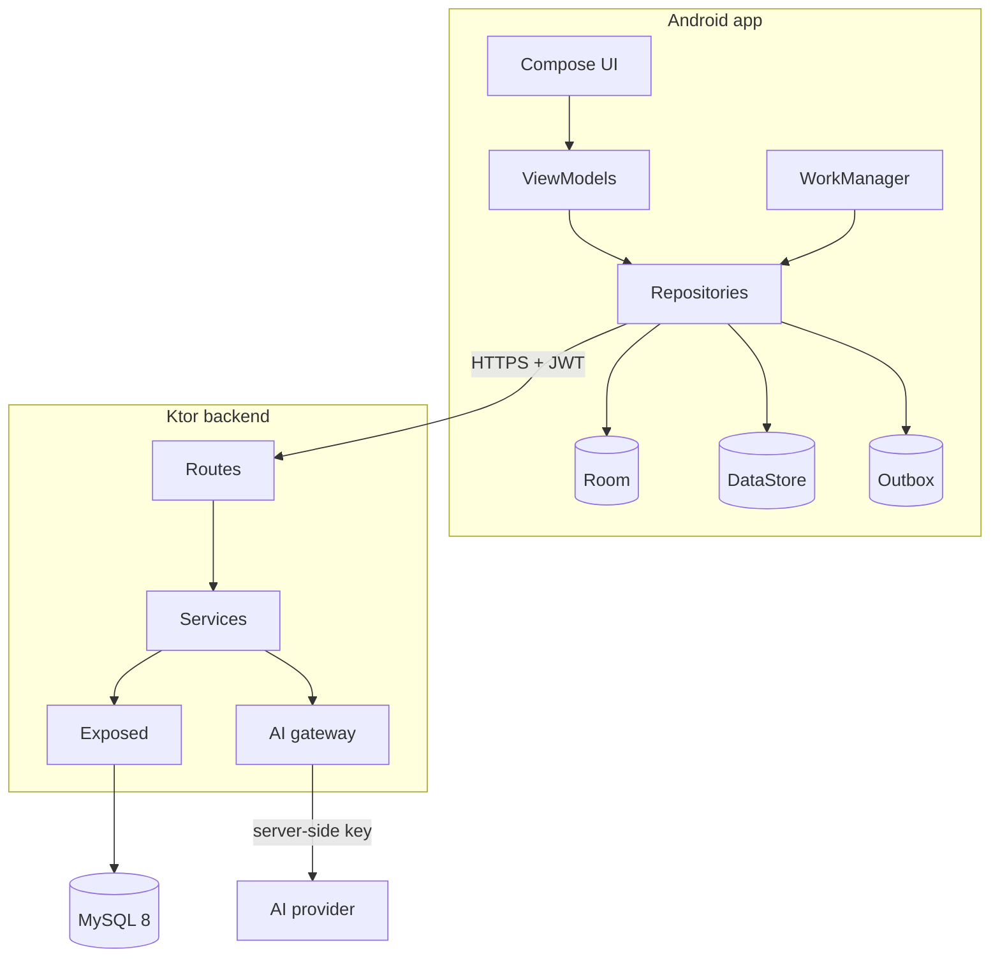
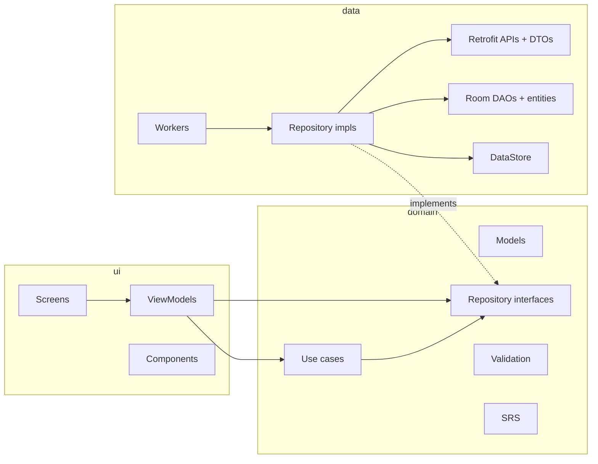
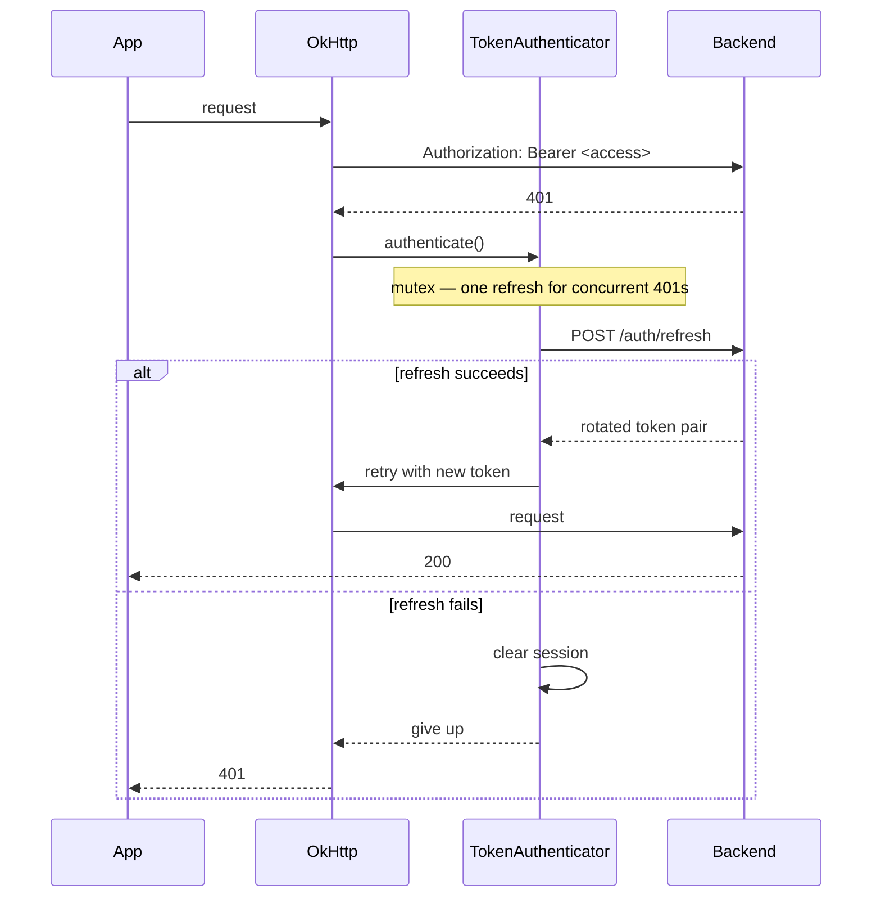
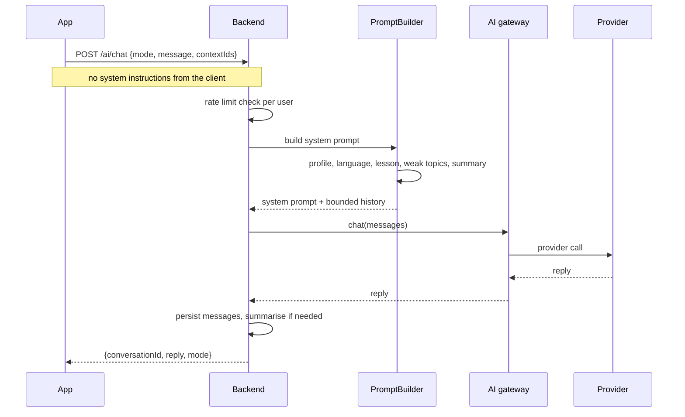
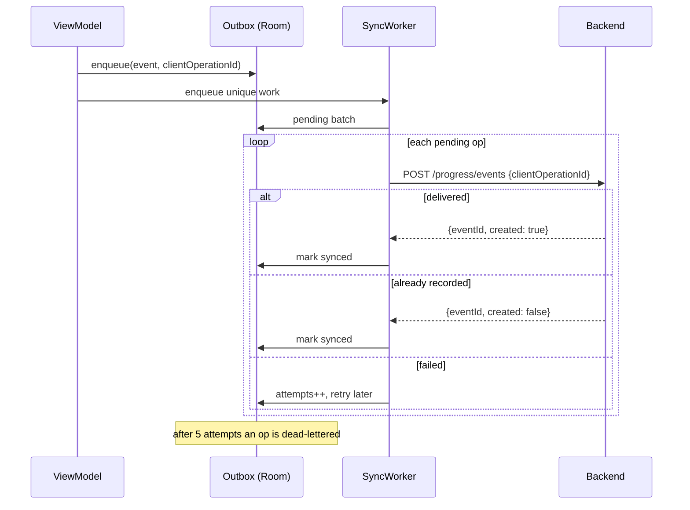
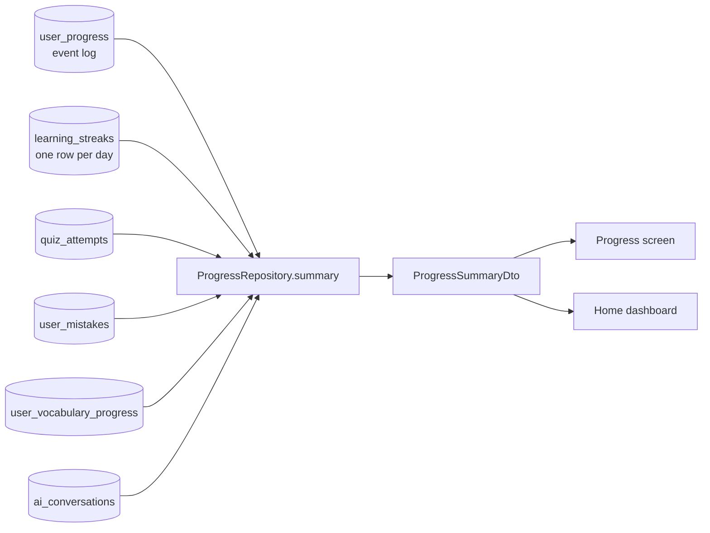

# Diagrams

Mermaid sources for the views that are easier to read than to describe. GitHub
and most Markdown viewers render these inline.

## System

## Clean architecture inside the app

Dependencies point inward: `ui` and `data` know `domain`; `domain` knows neither.

## Auth and token refresh

## AI request path

## Offline event sync

## Progress aggregation

The streak is derived from `learning_streaks`, never stored as a counter, and both
the Progress screen and the home dashboard read the same endpoint so they cannot
disagree.
