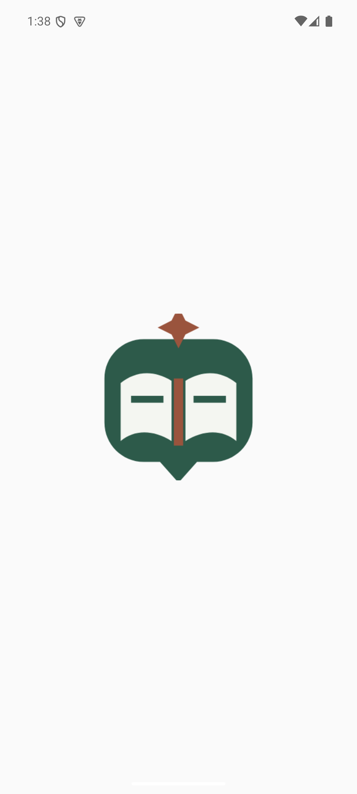
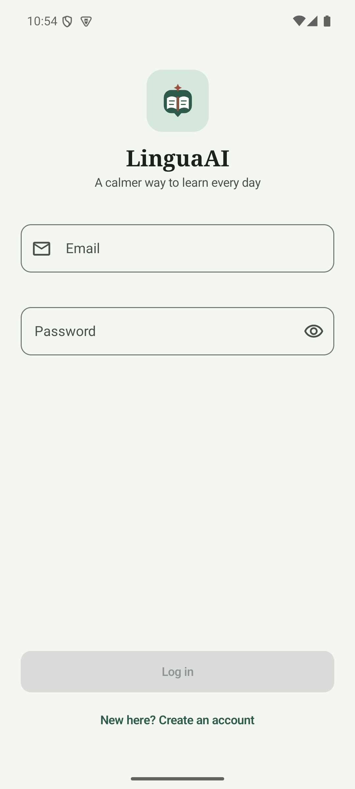
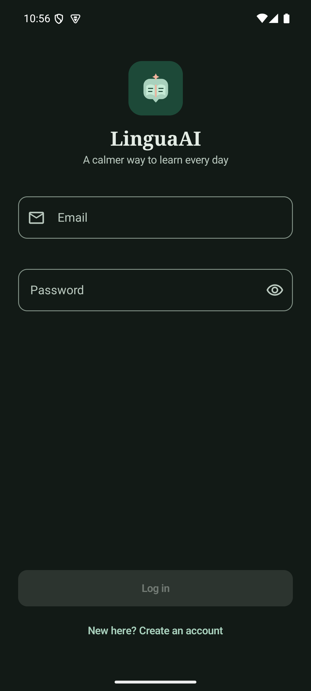
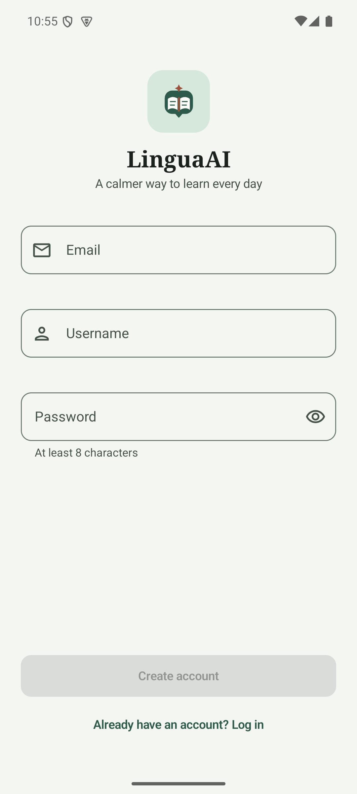
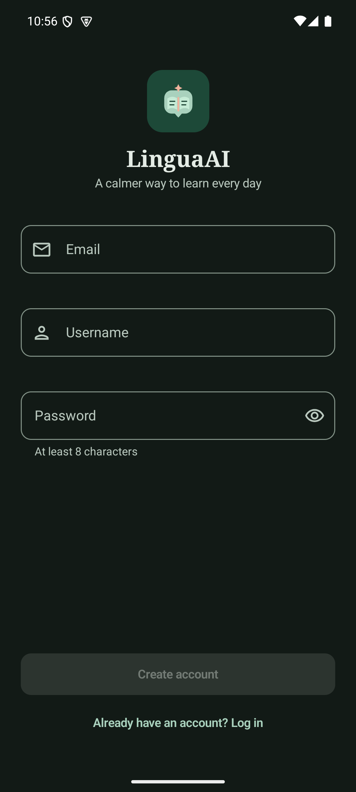

# Screenshots

These are live captures from the current debug APK on the `linguaai-api35`
Android 15 emulator at 1080x2400. They document the auth entry surfaces in both
theme modes; the 16 Compose/device cases and the authenticated route walk were
verified separately. The broader route evidence and UI hierarchy dumps remain
in the local visualization workspace so this small catalogue stays focused on
the reusable entry-brand surfaces.

| Surface | Light | Dark |
| --- | --- | --- |
| System splash |  | — |
| Login |  |  |
| Register |  |  |

Captured: 2026-09-14 from the current debug APK after the Compose and
adaptive-launcher logo vectors were synchronized. The captures also verify the
light/dark auth lockup and the responsive bottom action placement.
