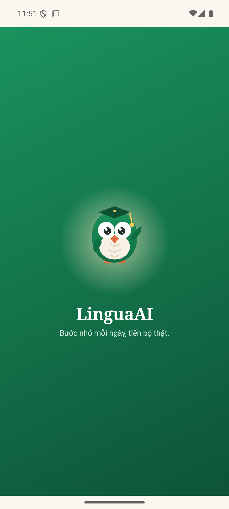
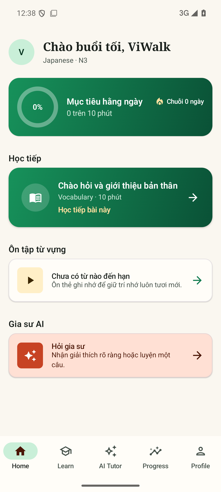
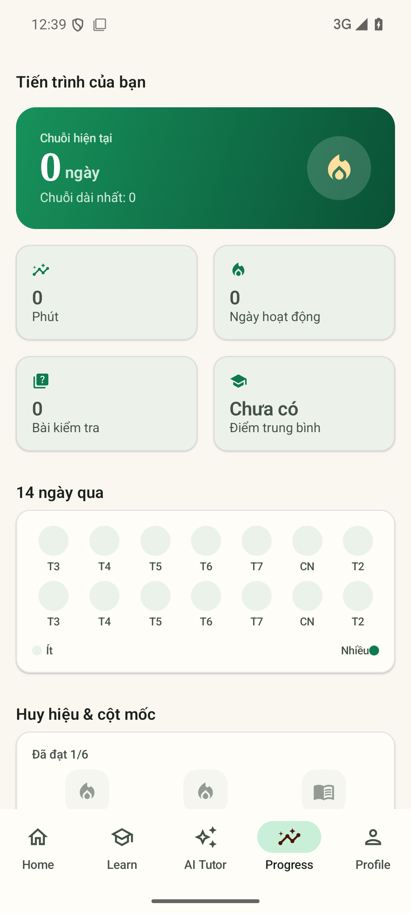
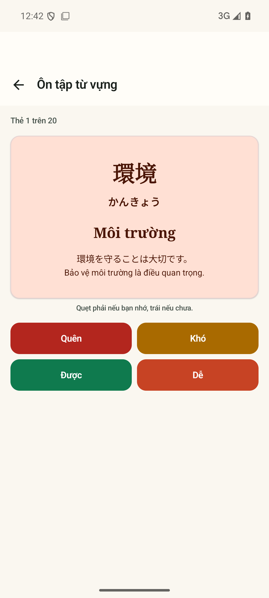
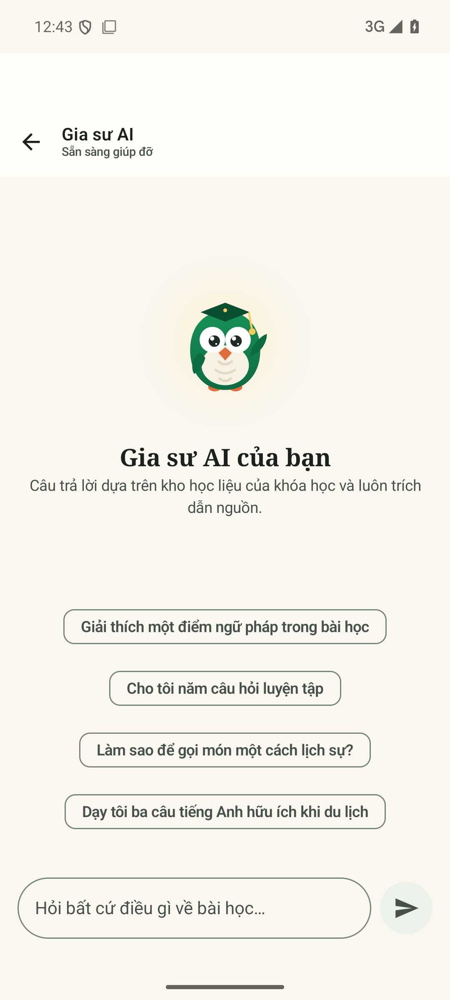
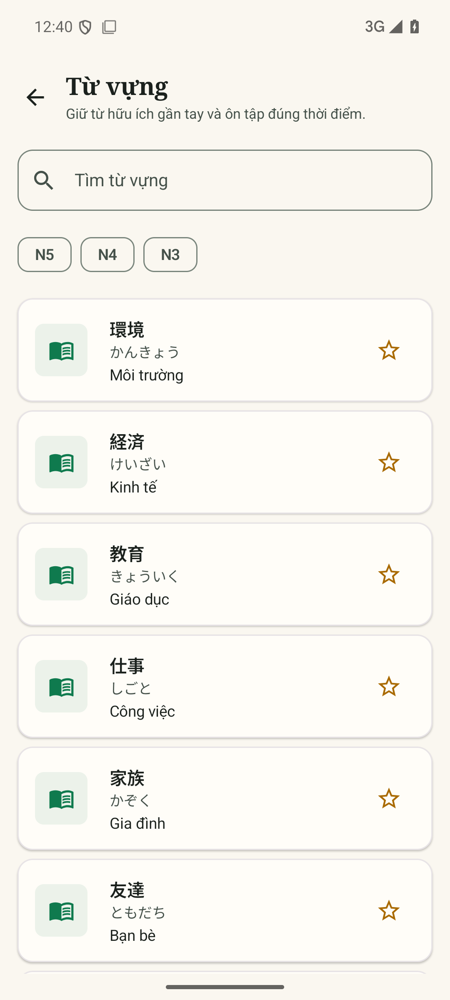

# LinguaAI UI design language

The visual system behind the current Compose screens: brand direction, the
tokens that encode it, the shared component library, the screen patterns that
reuse them, and the rules for extending all three. Source of truth is the code
under `android/app/src/main/java/com/linguaai/app/ui/`; this page documents it
and says which file owns each decision.

## 1. Brand

LinguaAI is a playful-premium language learner. The direction was seeded with
Google Stitch (three MOBILE screens generated 2026-09-19, hand-spec'd in
`plans/260919-0843-brand-uiux-bigdata/assets/DESIGN.md`) and baked into code in
the token-first redesign (`plans/260921-2248-fe-uiux-ultra/`). Emerald leads the
identity, coral and amber carry celebration (streaks, XP, the user's chat
bubble), and everything sits on warm cream paper surfaces — rounded, generously
spaced, no arcade gimmicks. The face of the brand is "Lingua", an owl in a
graduation cap; the mark is an open book inside a conversation bubble with a
small spark for the AI companion.

## 2. Design tokens

All color literals live in `ui/theme/Color.kt`; gradients in `BrandGradients.kt`;
shape/spacing/motion/type in `Shape.kt`, `Spacing.kt`, `LinguaMotion.kt`,
`Type.kt`. Screens must not hardcode values from this table.

### Color roles

| Role | Light | Dark | Use |
| --- | --- | --- | --- |
| Primary | `#0F7A4E` | `#7FDCA8` | Brand emerald: CTAs, active nav, mastery bars |
| PrimaryContainer | `#C9EFD8` | `#0A5136` | Chips, highlighted cards, badge-earned tile |
| Secondary | `#C74324` | `#FFB59A` | Coral: streaks, user chat bubble, HARD-side accents |
| SecondaryContainer | `#FFE0D4` | `#78301B` | Coral-tinted surfaces, revealed flashcard face |
| Tertiary | `#A96A00` | `#FFC95C` | Amber: XP, celebration, weak-topic markers |
| TertiaryContainer | `#FFEFC7` | `#604100` | Amber-tinted surfaces; mascot glow source |
| Background | `#FAF7F0` | `#101914` | Warm cream app canvas |
| Surface | `#FFFDF8` | `#18241D` | Cards |
| SurfaceVariant | `#ECF2EA` | `#2A3A30` | Muted inputs, stat tiles, dividers |
| Outline | `#79857C` | `#829287` | Hairlines, tutor bubble border |

`on*` companions and the unchanged error family are in `Color.kt`;
`Theme.kt` maps everything into the Material 3 schemes and follows the system
light/dark setting with fixed brand colors.

### Heatmap ladder (5 steps)

Bucket from minutes: `0` (none), `<5`, `<15`, `<25`, `25+`. Defined as
`HeatmapLight0..4` / `HeatmapDark0..4`; consumed by the progress heatmap
(`ProgressScreen.kt`).

| Bucket | Minutes | Light | Dark |
| --- | --- | --- | --- |
| 0 empty | `<= 0` | `#EAF2EA` | `#22302A` |
| 1 light | `< 5` | `#BFE3CB` | `#1D4938` |
| 2 mild | `< 15` | `#7FC79B` | `#2A6E4E` |
| 3 warm | `< 25` | `#3F9E6B` | `#3F9E6B` |
| 4 hot | `>= 25` | `#0F7A4E` | `#7FDCA8` |

### Badge tiers

`BadgeGold #E8B93B`, `BadgeSilver #B9C4BD`, `BadgeBronze #CE8F5A`, plus
`BadgeLockedContainerLight #EEF1EC` / `BadgeLockedContainerDark #253029` in
`Color.kt`, and the `BrandGradients.BadgeGold` medallion gradient
(`#F3CE63 → #D99B23`). The shipped progress badge strip currently renders
earned/locked tiles from tonal scheme containers (`primaryContainer` vs a
60%-alpha `surfaceVariant`); the direct tier colors are reserved for medallion
treatments. Semantic accents `StreakFlame #E06B3C` and `SuccessGreen #2F6B4F`
are declared alongside.

### Gradients (`BrandGradients.kt`)

| Token | Value | Use |
| --- | --- | --- |
| `hero()` | light `#17925B → #0A5136`, dark `#0E6B44 → #073823` | Hero cards, splash canvas |
| `AccentPill` | `#C74324 → #E06B3C` | User chat bubble, streak pills |
| `BadgeGold` | `#F3CE63 → #D99B23` | Gold badge medallion |
| `mascotGlow(color)` | radial `color @ 0.55 → transparent` | Celebration moments |
| `OnHero` / `OnHeroMuted` / `OnHeroAmber` | `#FFFFFF` / `#CFE9DA` / `#FFDF9E` | Text and icons on any hero gradient, both modes |

### Shape and spacing

`LinguaShapes`: 6 / 10 / 14 / 20 / 28 dp (extraSmall → extraLarge) — rounder
than Material defaults for cards and heroes, crisp for chips. `Spacing`:
xs 4, sm 8, md 16, lg 24, xl 32, xxl 48, xxxl 64 dp.

### Motion (`LinguaMotion.kt`)

| Spec | Value | Use |
| --- | --- | --- |
| `DURATION_FAST` / `fast()` | 120 ms, FastOutSlowIn | Press/hover micro-feedback |
| `DURATION_MEDIUM` / `medium()` | 240 ms, emphasized cubic(0.2,0,0,1) | Standard state changes |
| `DURATION_SLOW` / `slow()` | 400 ms, emphasized | Entrances |
| `pop()` | spring, medium bouncy / medium stiffness | Splash scale-in |
| `smooth()` | spring, no bounce / medium-low stiffness | Flashcard flip-in and swipe spring-back |

### Type

Serif display axis (`displayLarge → headlineSmall`, Bold/SemiBold) for heroes
and card titles; platform sans (`title* / body* / label*`) for everything
readable. Platform fallback is deliberate: it keeps Vietnamese and Japanese
glyphs correct without shipping font files (offline contract).

## 3. Component library

Shared atoms in `ui/components/`. Prefer these over raw Material3 wrappers so
the next token pass stays one-file-deep.

| Component | What it is | Use it for |
| --- | --- | --- |
| `LinguaMark` / `LinguaMarkTile` | Canvas-drawn brand mark (book-in-bubble + AI spark); the tile wraps it in a 72 dp rounded surface plate | Auth and splash lockups; scalable to any size |
| `LinguaMascot` | Owl artwork (Wave / Book poses, vector drawables) over a radial glow with a gentle bob | See section 5 |
| `LinguaCard` | Full-width card: 1 dp elevation (4 dp pressed), 1 dp hairline border at 45% `outlineVariant`, `shapes.medium`, optional click | Every content card |
| `IconTile` | 48 dp tonal rounded square holding a 24 dp icon | Leading icon on list rows and cards |
| `LinguaButton` / `LinguaTonalButton` / `LinguaOutlinedButton` | 48 dp-min-height button family, `shapes.medium`, built-in loading spinner on the primary; each sets `contentDescription = text` semantics | Primary / secondary / tertiary actions |
| `SectionHeader` | Title row with optional trailing slot | Dashboard section titles |
| `EmptyState` | Centered title + message + optional action, leading visual is either a tinted icon or a full `art` slot (mascot) | Zero-data states |
| `ErrorState` | "Something wrong" + message + retry | Failure states |
| `LoadingIndicator` | Centered spinner | In-flight states |
| `LinguaBottomBar` | `NavigationBar` on surface, zero tonal elevation, `primaryContainer` indicator, filled/outlined icon pair per route | The five top-level destinations only |
| `OfflineBanner` | Sticky banner for offline or stale-cache data | Any screen with a ViewModel `isOnline`/`isStale` signal |

## 4. Screen patterns

### Hero card

A full-bleed `BrandGradients.hero()` panel clipped to `shapes.large`, text only
in `OnHero` / `OnHeroMuted` / `OnHeroAmber`. Three instances today: splash
(whole screen as brand moment, mascot scale-in via `pop()`), home (daily-goal
ring card with streak flame, and the continue-lesson card), progress (streak
hero with `displayMedium` day count and a translucent flame disc). Keep the
hero to one per screen; it is the state-driven celebration surface, not a
header.

### Progress heatmap (`ui/screens/progress/ProgressScreen.kt`)

- Renders exactly `summary.recentActivity.size` days — never a padded month —
  in rows of 7 (`chunked(7)`), trailing rows spacer-padded to keep circle
  widths. The section title key is `progress_last_14_days`, so the window is
  never overstated.
- Cell color = `intensityBucket(minutes)` on the ladder above; pure function,
  `internal` for tests.
- Weekday labels under each cell come from the parsed ISO date via
  `dayOfWeek.getDisplayName(NARROW, Locale.getDefault())`, so they localize;
  an unparseable date renders no label rather than a guess.

### Badge strip

Six badges, each a pure predicate over `ProgressSummaryDto` in `BADGE_SPECS`;
derived at render time, never persisted, zero new data sources.

| Badge | Earned when |
| --- | --- |
| Flame | current streak >= 3 days |
| Blaze | current streak >= 7 days |
| Vocabulary | mastered words >= 50 |
| Quiz | average score >= 0.8 (null average counts as 0) |
| Time | total minutes studied >= 60 |
| AI | at least 1 AI conversation |

Rendered as a 3-column strip inside one `LinguaCard` with an "n of 6" caption.

### Chat starter chips (`ui/screens/ai/AiChatScreen.kt`)

Before the first exchange, the empty transcript shows the mascot, a title/body,
and mode-aware `SuggestionChip`s. A tap calls the existing
`viewModel::onInputChanged` — chips never bypass the normal send path. Render
gate: not loading, transcript empty, no error on an empty transcript, and no
practice scorecard.

| Mode (`state.mode`) | Chips |
| --- | --- |
| `grammar-explain` | grammar help, questions, my mistakes |
| `sentence-correction` | correct my sentence, food topic |
| `mistakes` | my mistakes, grammar help |
| `conversation-practice` | start role-play, travel topic |
| anything else | grammar help, questions, food, travel |

Bubble restyle stayed token-only: tutor bubble = surface + outline, user bubble
= `AccentPill` gradient. The `"Tutor."` contentDescription prefix, the
`ai-chat-transcript` LiveRegion, and merged-announcement logic in
`TutorRichText.kt` are test-asserted and must not change.

### Flashcard gestures (`ui/screens/flashcard/FlashcardScreen.kt`)

- Prompt face on `primaryContainer`; "Show answer" reveals the `secondaryContainer`
  face, which flips in on the Y axis from −90° via `LinguaMotion.smooth()`
  instead of popping.
- After reveal, horizontal drag grades: cumulative drag right past 110 dp sends
  `GOOD`, left past 110 dp sends `AGAIN`; the card tilts at 0.06° per dragged dp
  and always springs back to center (`smooth()`), since grading advances the
  queue.
- Swipes are additive, not exclusive: the four grade buttons (AGAIN / HARD /
  GOOD / EASY) remain, and both paths call the unchanged ViewModel events.

## 5. Mascot usage

`LinguaMascot` renders `mascot_owl_wave` or `mascot_owl_book` (vector drawables)
at any `mascotSize`, over a radial glow 1.5× the size tinted with
`tertiaryContainer` at 65% alpha, bobbing on a 1.8 s reversed loop (offset =
bob · size · 0.03, bob ∈ [−3, 3]; pass `animated = false` for static
placements).

Pose map: Wave on splash (132 dp), onboarding step header (84 dp) and chat
empty (104 dp); Book on the vocabulary empty state (96 dp, static).

`contentDescription` policy: the parameter is null by default and no semantics
node is added in that case — pure decoration. Splash, chat and vocabulary pass
the `mascot_content_description` string so the owl is announced where it *is*
the state's message. Onboarding deliberately keeps the mascot decorative: the
instrumented `OnboardingScreenTest` anchors on verbatim semantics strings
(`"Onboarding step N of 4"`, `"Continue"`, `"Start learning"`,
`"<lang> selected"`, `"60 min"/"20 min"`), and any extra node — including an
announced mascot — would change the asserted semantics tree. Treat those
literals as test selectors: touching them is a test edit, which the redesign
plan forbids.

## 6. Screenshots

Captured from a `vi-VN` locale emulator (1080x2400); committed copies in
`docs/img/`.

| Splash | Home | Progress |
| --- | --- | --- |
|  |  |  |
| Swipe-to-grade flashcards | AI tutor chat | Vocabulary catalogue |
|  |  |  |

## 7. How to extend

- New color, gradient, shape, spacing, motion or type value: add it to the
  owning file in `ui/theme/` first; screens reference tokens, never literals.
- New shared visual: component it in `ui/components/` (`BrandComponents.kt` for
  artwork, `CommonComponents.kt` for layout atoms) and add a row to the table
  in section 3. Screen-private composables stay in their screen file.
- Every new user-facing string goes into **both** `res/values/strings.xml` and
  `res/values-vi/strings.xml` in the same commit — 229 keys each today, and a
  `diff` of the two key lists must stay empty; key-parity checks gate every
  phase exit.
- Screens with instrumented-test anchors (onboarding, AI chat semantics, auth
  fields) accept token-level edits only: no added or removed semantics
  modifiers, no changed test-asserted strings or tags.
- Mascot artwork is vector XML (`res/drawable/mascot_owl_*.xml`); a new pose
  means a new `LinguaMascotPose` entry plus drawable, not a raster.
